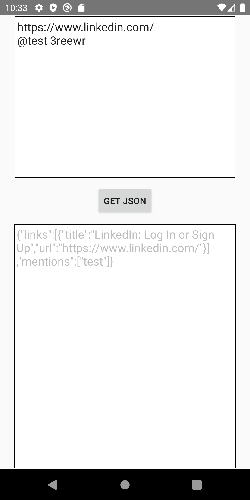

# interview_android_java8

Interview Project with Java8 - MVVM - Hilt - LiveData - Data Binding

Introduction
-------------

### Functionality
The app have one screens.
User inputs his comments and get the json result.

### Testing
The project uses UnitTest tests that run on the device.

##### ViewModel Tests
Each ViewModel is tested using local unit tests with mock Repository
implementations.
##### Repository Tests
Each Repository is tested using local unit tests with mock AppExecutor
##### Model Tests
We test Class *LinkUrl* to test function getTitle from url 

### Libraries
* [Android Architecture Components][arch]
* [Android AndroidX] to support UI Androidx 
* [Android Data Binding][data-binding]
* [Gson] to parse json from object 
* [Dagger Hilt] for dependency injection
* [mockito][mockito] for mocking in tests

CHECKLIST 
-------------

1. Programming language: Java 8 -- DONE
2. Design app's architecture (suggest MVVM).  -- DONE
3. Apply LiveData mechanism -- DONE 
4. UI should be looks like in attachment. -- DONE
5. WriteUnitTests -- DONE 
6. Readme file includes: -- DONE 

RESULT
-------------

